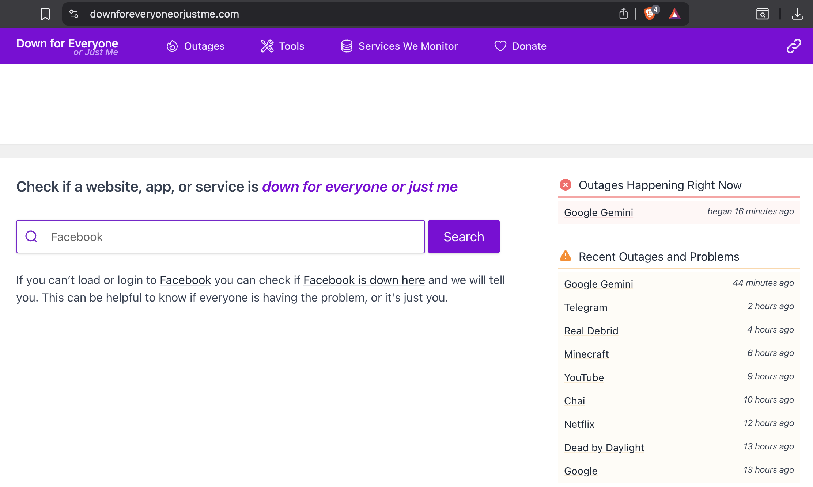

---
layout: page
title: About
permalink: /about/
sitemap_priority: 0.7
description: Benji, a Product Manager mixing Sociology and Systems Analysis to build tech with impact and meaning. Focus on UX research, media, wellness, decentralized ecosystems, and human-centric product strategy.
--- 

 
# Product Sociologist

I am a **Product Manager** with over 5 years of experience in the tech industry. My unique edge comes from combining a **Master’s in Sociology** with **Systems Analysis**. 

I don't just build features; 
I analyze how users and communities behave to create products that mean something. It's not just about delivery, but like the late Tony Hsieh, Zappos´ CEO, said "delivering happiness".

<a href="/portfolio/" class="bootstrap-primary-btn">
  See my Product Portfolio
</a>

 
## *I make tech startups launch products from 0-to-1, mixing deep user insights with sociology and systems analysis.*
 

## My strengths

### 1. Product Strategy & Discovery
It's super important to listen to users. I have a background in **ethnographic research** which makes me look for the insights that serve to best understand problems and ideate solutions. 
* **NEWM:** I was the main staff product person to build a decentralized music ecosystem from o to 1, one product at a time, giving distribution and ownership to artists.
* **Incubation:** Pitched and prototyped over a year, with 2 Hackathons, and a project presented at **ETHargentina 2023**. [See my 3-minute pitch](https://youtu.be/0ZllEEaVkq0?t=5203).

### 2. Systems Thinking
Currently finishing a **Systems Analyst thesis** on Internal Inventory Management. I look to resolve how to build the complex backend logic and processes, and at the same time make it so the frontend experience is intuitive with UX and Information Architecture.

### 3. Tech Aim
I'm not a developer, but still I believe that people can build things by themselves. I've believed this since using Linux in 2005. Becoming "Technical Independent" can take a long time, but I've always preferred building with static code myself (or some "free" AI assistance) because ownership matters, as well as understanding the raw materials of how to build stuff. This site is not full of flare but a milestone of building with the bare bones, rather than a no-code black box.
<!-- > "Control the narrative, instead of giving the content away to some soulless corporation."  -->

| {:target="_blank"} |
|:--:| 
| *Several major platforms are known to have had outages. Picture from February 2026* |

> "It’s my belief that everybody should have their own slice of the Internet. Share your opinions, document your life."
— [*Josh Sherman*](https://joshtronic.com/ai/)

 

## 🎓 My Academic Background
* **M.A. in Sociology:** I made my Thesis research on urban spaces and public art behavior. These days, I still use the skillset to keep **Information Architecture (IA)** clean, and listen to users closely with an alert eye to **Customer Experience (CX)**.
* **Systems Analysis:** I have a decent understanding of system logic and architecture, data quality, data structures, inventory logic, technical delivery, business rules, and how everything needs to sync together to make the whole tech and human system work.

 

<!--
Pixo: Culture
JB: Execution
Tizi: Strategy
-->

## Strong, and nice, things people say about me

<!--
<section id="recommendations" style="margin-top: 50px;">
  
  

    
    

      
    

    

      <h4 style="margin: 0; color: #ffffff; font-size: 1.1rem;">{{ rec.name }}</h4>
      

        {{ rec.role }} • {{ rec.type }}
      

      
      <blockquote style="font-style: italic; color: #d1d1d1; border: none; padding: 0; margin: 0; line-height: 1.6;">
        "{{ rec.quote }}"
      </blockquote>
      
      

        <a href="{{ rec.link }}" target="_blank" style="font-size: 0.8rem; color: #74c0fc; text-decoration: none; opacity: 0.8;">
          Verify on LinkedIn ↗
        </a>
      

    

    
  

  
</section>
-->

<section id="testimonials" style="margin-top: 40px; color: #f0f0f0;">
  
  

    
    

      

        
        

          <strong>Juan (JB) Bidondo </strong>
          CEO @ TOTS
        

      

      
Execution

      

        "[Benji] will just jump over and start shaking things up fast and for the best. He manages strong attributes when it comes to precise communication and following precise roadmaps. We were looking for a special person to add order and personality to a special app launch and we definitely found it."
      

      <a href="https://www.linkedin.com/in/bj-pm/details/recommendations/" target="_blank" class="testimonial-link">LinkedIn ↗</a>
    

    

      

        
        

          <strong>Tiziana Pittini</strong>
          CPO @ NEWM
        

      

      
Strategy

      

        "Benji was pivotal in the successful launch of our flagship product, NEWM Studio, as well as the Stream Token Marketplace. These products in the ecosystem, and Benji as the PM, were key in the organisation of the development team’s tasks and priorities."
      

      <a href="https://www.linkedin.com/in/bj-pm/details/recommendations/" target="_blank" class="testimonial-link">LinkedIn ↗</a>
    

    

      

        
        

          <strong>Andres (Pixo) Perea </strong>
          CEO @ WillDom
        

      

      
Culture

      

        "I was impressed by Benjamin's ability to handle any situation calmly and patiently, even with the toughest projects. This natural skill of his has helped us to grow our marketing engine."
      

      <a href="https://www.linkedin.com/in/bj-pm/details/recommendations/" target="_blank" class="testimonial-link">LinkedIn ↗</a>
    

  

</section>

<!--
 
## 🎯 Next Step Challenges
I am now leaning and reading more into **Artificial Intelligence**, **Product Discovery**, and every piece of text, even memoirs and bios, that teach me more about product and leadership. 
###### If you have feedback on these or other topics, please let me know. It's tough love perhaps, but much encouraged. Thanks! 
-->
<!-- I crave feedback to improve my awareness and systems. -->

<!-- 
## Let's Connect
I'm looking for PM roles where I can apply sociological insights to technical products. 
-->

<!--
<a href="https://calendly.com/venhamon" target="_blank" class="bootstrap-primary-btn">
  Book a Discovery Call
</a> 
-->

<!--
<a href="/books/" class="mono-scale-btn">Browse My Library</a> 
-->

 
 
 

# Also see my [CV](../cv/) and [Goals](../goals/) sections

###### Is your team building something with a strong human, health, media, or community component?

##### [Book a Discovery Call](https://calendly.com/venhamon){:target="_blank"}

