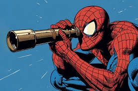
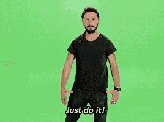

I'm Benji, and this is what I'm looking for.

|  | 
|:--:| 
| *Looking for new horizons* |

# I'm a [Product Manager](/about/)

### I'm into these industries: Health, Social Impact, Music

The goal of this page is to help others understand what I offer, uncover opportunities I haven't considered, and connect with people in the industry.

## Job Hunting: Candidate-Market Fit [CMF]

I am seeking a <strong>Product Manager role </strong> at an early-stage startup <strong>Series A</strong>. I'm at my best at the intersection of design, customer experience (UX), and high-impact industries.

### Favorite Industries
* **Wellbeing:** Meditation, Sleep, Longevity, Fitness.
* **Social:** Travel, Hospitality, Health, Ed Tech, Crypto.
* **Media:** Music, Gaming, Publishing, Blockchain.

### Ideal Team & Product
* **Vision:** Product-informed cycles, not just sales-driven.
* **AI Usage:** Leveraging AI to solve problems, even if not user-facing.
* **Must-have:** Data-driven decision making.

|  | 
|:--:| 
| *The path ahead* |

## Roadmap & Growth

### Short-Term: Core Data Skills [6-12 Months]
*Focus: Strengthening Al framing and impact with a data-driven mindset.*
* **AI Framing:** Understanding AI impact. Action: See books and opinionated stance on [/ai/](/ai/).
* **Data-Driven Decisions:** Focusing on user segments, personas, and feature validation through customer pain points.
* **Formal Training:** Pursuing certifications at Scrum.org and attending industry conferences.

### Mid-Term: Strategic Vision [2-3 Years]
*Focus: Expanding impact and mastering macro-level market understanding.*
* **Innovation:** Fostering creativity and understanding market trends and competitive landscapes.
* **Impact:** Leading workshops, hackathons, and participating in Product Hunt launches.
* **Planning:** Creating long-term product visions that align with company goals.

### Long-Term: Culture & Leadership [5-10 Years]
*Focus: Building from the ground up and mentoring the next generation.*
* **Leadership:** Building and managing cross-functional teams to inspire innovation.
* **Venture:** Joining a startup as a co-founder or starting a new venture.

|  | 
|:--:| 
| *Sometimes you just do things* |

## Strengths (Gallup-Based)
* **Philomath/Curious:** I prefer ongoing questions over closed answers. *"The mind is not a vessel to be filled, but a fire to be kindled." — Plutarch*
* **Believer:** High drive and persistent; I believe in people's capabilities.
* **Coach/Supportive:** I push causes to happen. *WAGMI (We're All Gonna Make It).*
* **Self-Believer/Ownership:** Confident in moving forward and encouraging others.
* **Strategist:** Focused on long-term positive impact and meticulous planning.

#### Dream Idea: Earthworms
Inspired by *Pay It Forward (2000)*, I have been giving away vermicomposting-recycling for a decade. I am constantly exploring how to create a global chain reaction for environmental impact.

## Connect

 <a href="https://calendly.com/venhamon" target="_blank" class="bootstrap-primary-btn" aria-label="Contact me via email">Let's meet up! :)</a>

---

###### /Goals/ page: Last updated on Decemeber 29, 2025

###### PDF version of this page: [here](../assets/docs/benji-goals.pdf).

<!-- Bootstrap Primary button – clean white-text hover -->

<!-- Button: Monochrome scale button with elevated effect -->
