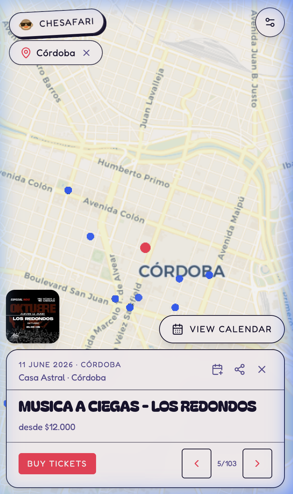
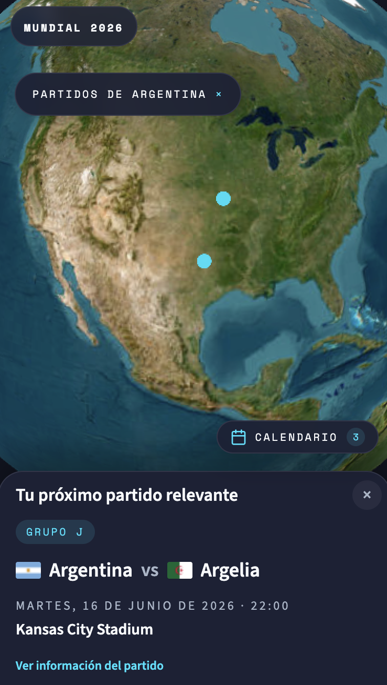
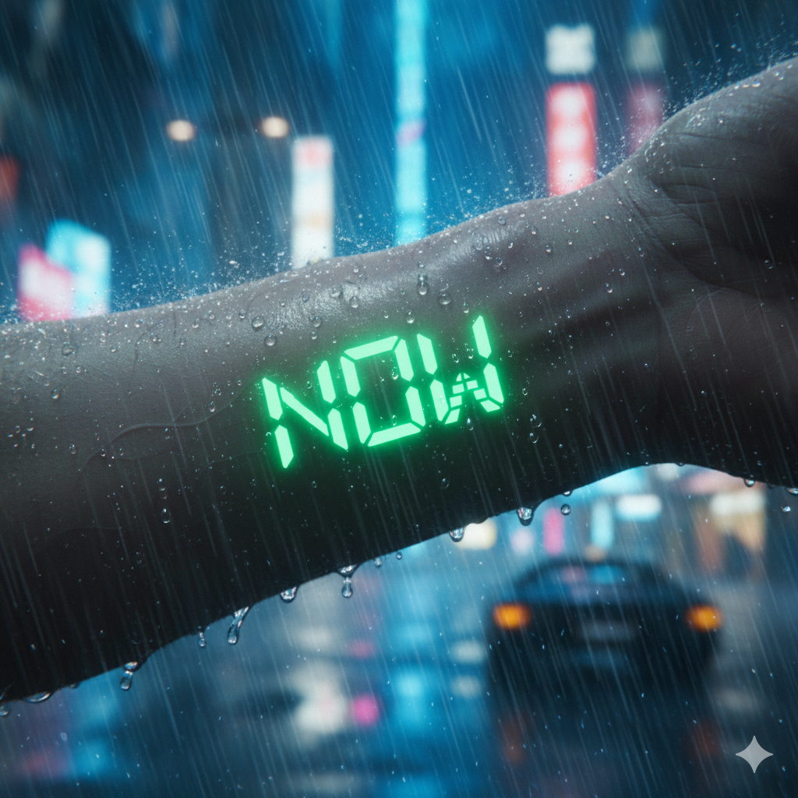

## Doing Product in Tech & Media

 

### Building *Che Safari* with [Fabio](https://fabiogiacometti.framer.website/){:target="_blank"}

# &#128053; [https://chesafari.xyz/](https://chesafari.xyz/)

Che Safari is: An event platform to find live music near you.

  

    Show Che Safari Details & Showcase
    <i class="fa-solid fa-chevron-right" style="font-size: 0.85rem; transition: transform 0.2s ease;"></i>
  

  

* **Problem:** people want to go see live music but doomscroll through instagram and ticket platforms. This happens to users, venues and artists, they can't find each other.
* **Solution:** build the dedicated platform for this. It doesn't exist yet as a major solution, there's just fragmented solutions. Maybe we can even plan the whole night, or week ahead of time. No login required. Just search and get out.
  * "Che" stands for nudging friends in Argentina
  * "Safari" stands for exploring what's outside
* **Monetization:** We don't charge anything to end users. If we can show that enough people use the platform, we expect that users travelling 
<!-- venues and artists  -->
are going to want to be a part of this. 
Model is now B2B, making arrangements with Embassies and Consulates, Universities, and Tourist Guides.
<!-- Fingers crossed.  -->

  <a href="https://chesafari.xyz/" target="_blank" rel="noopener noreferrer" style="text-decoration: none;">
    
    <h4 style="margin-top: 12px;">Try CheSafari! </h4>
  </a>

  

<!-- #### Historic Safari  -->

<!-- ###### One-liner -->

<!-- > It's a map for important events in history: current and past. 

[Check The Prototype Here!](https://history-safari.vercel.app/) 

 

##### FIFA WorldCup Safari 2026

This is our spearhead to validate the product.

> It's a roadmap for important soccer events this year in Americas

|  | 
|:--:| 
| *FIFA WorldCup Historic Safari, 2026* |
| [Check The Prototype Here!](https://2026-fixture.vercel.app) | -->

<!-- 
[Check The Prototype Here!](https://2026-fixture.vercel.app) -->

<!-- 
* Problem: people who want to do vermi-composting but find it too hard to do, with worries about smell, space, and overall not knowing how to handle it.
* Solution: build the know-how along with your community.
* Monetization: pending (metadata showing impact on life quality?) -->

  



<!-- ## Building something new, I've started research on 
* Problem: people who want to do vermi-composting but find it too hard to do, with worries about smell, space, and overall not knowing how to handle it.
* Solution: build the know-how along with your community.
* Monetization: pending (metadata showing impact on life quality?)

  
 -->
<!--
# Playing Music
Playing Bass as a power trio with Sinapsys. 
[Sinapsys](https://www.instagram.com/sinapsysok/). 
Played my first live gigs in 2025
-->

<!--
<a href="/music/" class="mono-scale-btn" aria-label="Contact me via email">
My Favorite Music
</a>
-->

 

# Reading Books
Diving into **CX**, **UX**, **AI**, **data**, and **startup culture**. 

<!-- It helps to sharpen my Product Management skills. I´ve read plenty of product and business books this year, along with cyber security and some music memoirs and bios. Exploring a book exchange app idea to connect readers: I saw this idea [in paper at a local book store.](/books/#project-inception-favorite-book-sharing) -->

<a href="/books/" class="mono-scale-btn" aria-label="Contact me via email">
My Favorite Books
</a>

 

  
  

    Gemini image inspired on the <em>In Time </em> (2011) movie
  

## This is my *Now Page* 

##### This page reflects what I´m up to now.  

###### Inspired by Derek Sivers and the /now movement. See others: [nownownow.com](https://nownownow.com/)

###### /now/ page: Last updated on July, 2026

<!-- # Who am I? 

<a href="/about/" class="mono-scale-btn" aria-label="Contact me">
   Got a product role? 
  About Section Here
</a>

  -->

<!-- # Reaching Out
Do you know about [small blogging](https://jeremeyduvall.com/writing-on-the-web/) outside of the mainstream marketing sites? Do you know of other sites with pages like this one you´d like to share?  

I'm open to PM roles, :).  

Let's talk! When is:  -->

<!-- Monochrome scale button with elevated effect -->
 

<!-- <a href="https://calendly.com/venhamon" target="_blank" class="bootstrap-primary-btn">
  the best time for you?
</a> 



<!-- Bootstrap Primary button – clean white-text hover -->
 .bootstrap-primary-btn styles moved to now-styles.html 

 .custom-button and .note styles moved to now-styles.html 

